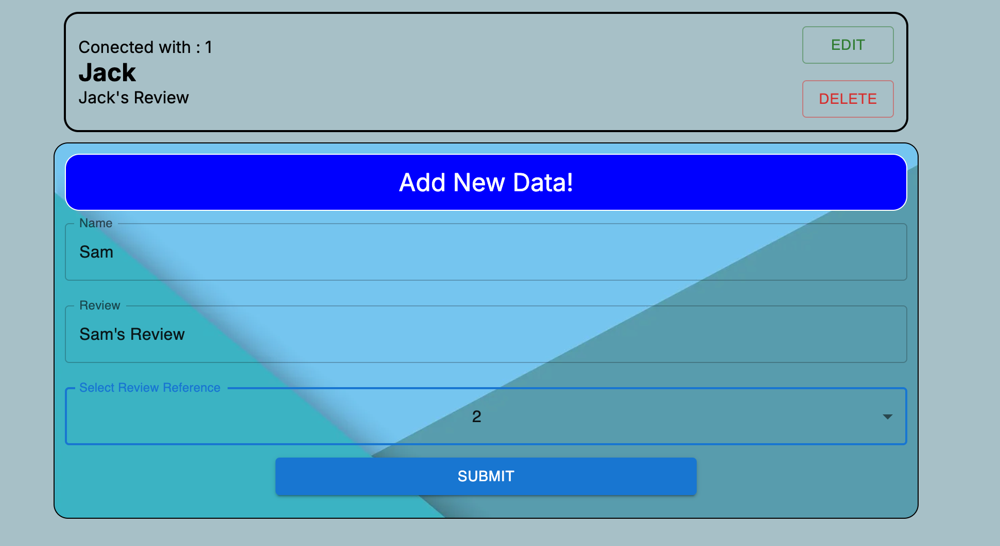
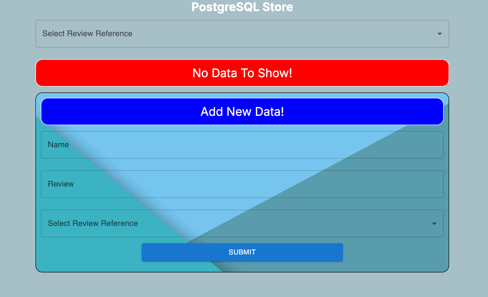
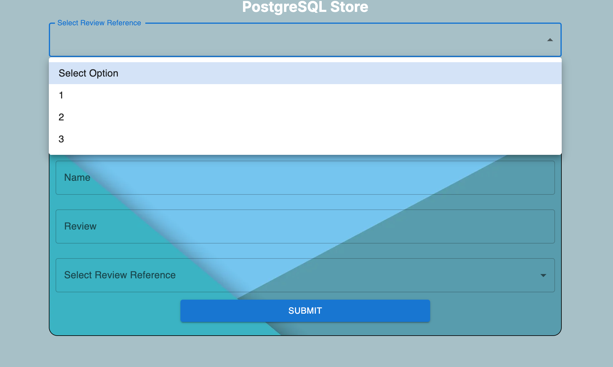
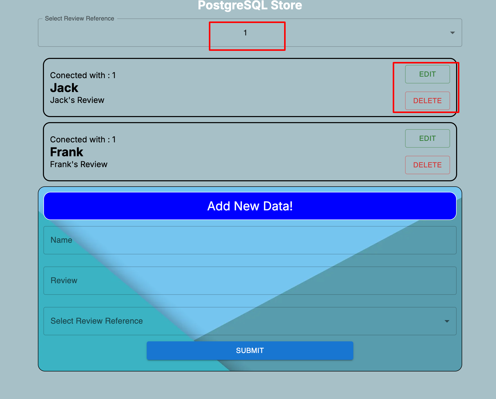
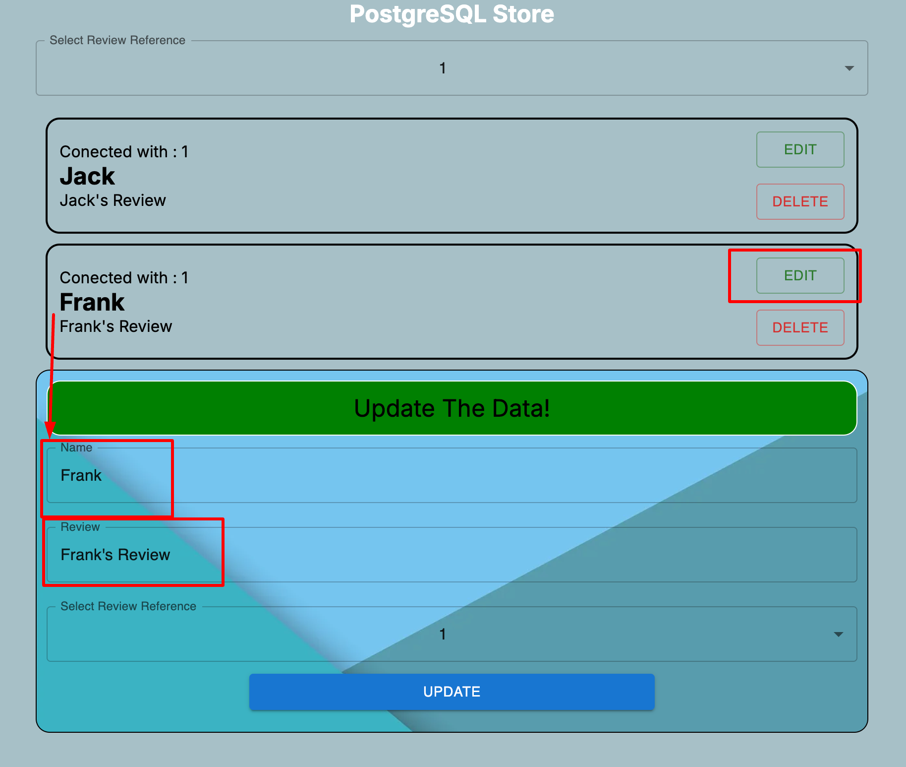
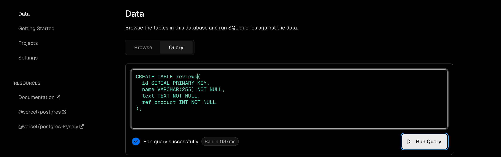

This is a [Next.js](https://nextjs.org/) project bootstrapped with [`create-next-app`](https://github.com/vercel/next.js/tree/canary/packages/create-next-app).

## Getting Started

First, run the development server:

```bash
npm run dev
# or
yarn dev
# or
pnpm dev
# or
bun dev
```

Open [http://localhost:3000](http://localhost:3000) with your browser to see the result.

You can start editing the page by modifying `app/page.js`. The page auto-updates as you edit the file.

This project uses [`next/font`](https://nextjs.org/docs/basic-features/font-optimization) to automatically optimize and load Inter, a custom Google Font.

## Learn More

To learn more about Next.js, take a look at the following resources:

- [Next.js Documentation](https://nextjs.org/docs) - learn about Next.js features and API.
- [Learn Next.js](https://nextjs.org/learn) - an interactive Next.js tutorial.

You can check out [the Next.js GitHub repository](https://github.com/vercel/next.js/) - your feedback and contributions are welcome!

## Deploy on Vercel

The easiest way to deploy your Next.js app is to use the [Vercel Platform](https://vercel.com/new?utm_medium=default-template&filter=next.js&utm_source=create-next-app&utm_campaign=create-next-app-readme) from the creators of Next.js.

Check out our [Next.js deployment documentation](https://nextjs.org/docs/deployment) for more details.


# Project Overview
In this project i implment a CRUD operation using next js and postgreSQL. I did not more focus on UI but i write code bignners friendly. 
Any one who has basic knowled of react js / javascript can understand.

So Let's play......



## Inital View



## Select Review Id and get data based on that Id


##  Data will shown related to selected review id


## Edit option



Here i am describing steb by step process to implement the code at your machine.

## Step 1 
Create a next js project, push it to you git account and deploye it on Vercel.
## Step 2
Create your account on vercel and create a database and create a new table in Data using below Query

CREATE TABLE reviwes (
  id SERIAL PRIMARY KEY,
  name VARCHAR(255) NOT NULL,
  text TEXT NOT NULL,
  ref_product INT NOT NULL,
);




## Step 3 
Create backend route (use path - src > app > api > product > [id] > reviews > route.js )
Create path for frontend as well ( use path - src > app > review > page.js & crate a new more path where logic will be writen, in review folder create a review.js file)

## Step 4
Go through the code and can modify according to your need. After that use/run command "npm run dev"


